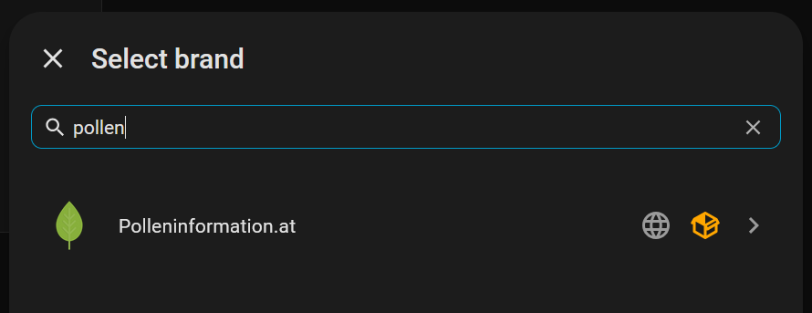
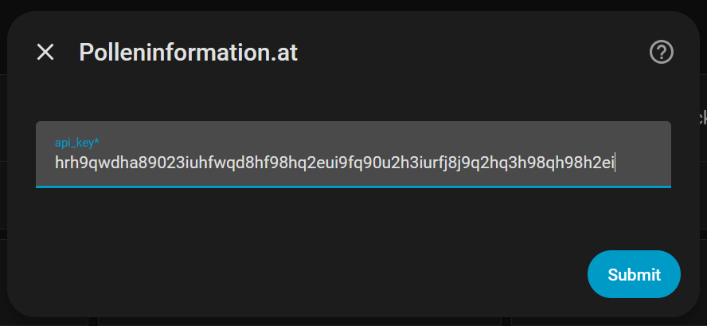
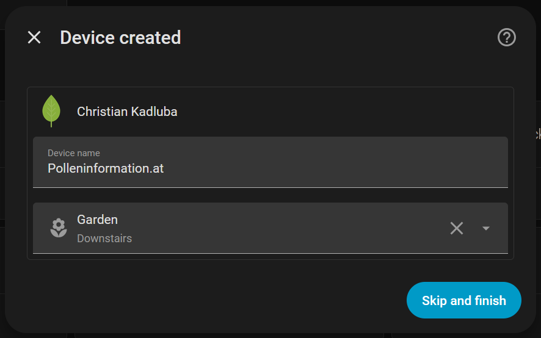
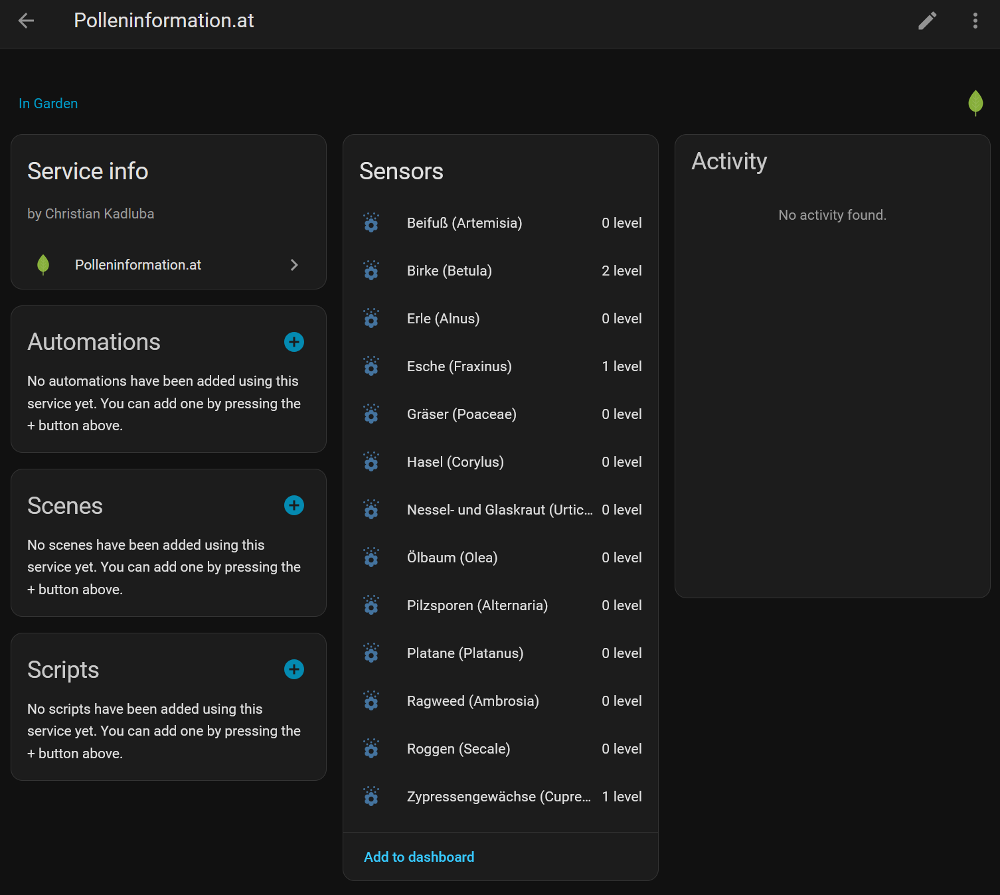

# Home Assistant Polleninformation.at HACS Custom Integration

This [HACS](https://www.hacs.xyz) custom integration enables access to pollen count data from the API of [Österreichischer Polleninformationsdienst (www.polleninformation.at)](https://www.polleninformation.at) in [Home Assistant](https://www.home-assistant.io).

## Disclaimer

This integration is not official software from Österreichischer Polleninformationsdienst, nor am I in any way associated with this organization. I'm just a person with a pollen allergy who wanted to have pollen count data for Austria available in Home Assistant, so I created this integration.

This software is provided under the **Apache License 2.0** and is offered **AS IS**, without warranty of any kind, express or implied.

The authors and contributors accept **NO RESPONSIBILITY** for:
- Data loss or corruption
- API rate limits, failures
- Unexpected behavior or incorrect results

**Important**: Always create backups of your Home Assistant system when using this integration.

## Installation and Configuration

1. Request an API key from [https://www.polleninformation.at/datenschnittstelle/api-key-anfordern](https://www.polleninformation.at/datenschnittstelle/api-key-anfordern).

1. Search for the "Polleninformation.at" integration in the HACS store in Home Assistant and install it.

1. Under Settings > Devices and Services, select Add Integration, then search for and add the "Polleninformation.at" integration.
   

1. A configuration dialog opens where you must enter the API key.
   

1. After that, another dialog for adding the Polleninformation.at device is shown. Select an area for the device and finish the configuration.
   

## Features and Restrictions

* The integration queries the API every six hours. This is a fixed interval and cannot be changed. Since the pollen data does not change that often within a day and to avoid API rate limiting or revocation of API keys, this relaxed interval was chosen.

* The location for which the pollen count is queried is taken from the configured location of the Home Assistant system. There is no possibility to specify a different location.

* A device named "Polleninformation.at" is created when installing the integration. Under this device, there will be a numerical sensor for each of the 13 pollen types covered by the www.polleninformation.at API.

  

  These sensors are numerical sensors representing the current pollen count returned by the API on a scale from 0 to 4.

* These Polleninformation.at integration sensors show the current pollen count. Pollen count predictions are not exposed, although the API offers such data.

## Development

All development steps and tests are performed inside the Dev Container. This ensures a consistent environment, just like in production.

### Starting Home Assistant with the Integration in the Dev Container

The Dev Container configuration is based on the official [HACS blueprint integration](https://github.com/ludeeus/integration_blueprint), so the debug procedure and scripts are similar.

1. In VS Code select `Dev Container: Rebuild and Reopen in Container`.

1. Create a new Python venv (e.g. using the VS Code Python extension).

1. Open a bash terminal session. The venv will automatically be activated. In the direcory `custom_components/polleninformation_at` run scripts/develop. All dependencies will be installed and Home Assistant is started.

1. Open the Home Assistant web UI in a browser (eg. http://localhost:8123, check the ports window in VS Code) and do the initial configuration.

1. Add and configure the Polleninformation.at integration under Settings - Devices & services.

### Running integration tests

To run integration tests like `test_async_update_fetches_live_data`:

1. Copy the file `.env.example` to `.env` in the project root.

1. Edit the `.env` file and enter your real API key and (optionally) adjust the test parameters.

   Example:
   ```env
   POLLENINFORMATION_AT_API_KEY=your-api-key-here # Comment this line to skip test_async_update_fetches_live_data
   POLLEN_API_TEST_LATITUDE=48.2082
   POLLEN_API_TEST_LONGITUDE=16.3738
   POLLEN_API_TEST_POLLEN_ID=23
   ```

   Note that you must have the setting `python.terminal.useEnvFile` set to true.

1. Open the project in a Dev Container.

1. Run the test using the test extension or using the command line.

   ```bash
   python -m unittest tests.test_api_integration -v
   ```

The test will only run and perform a live API call if the variable `POLLENINFORMATION_AT_API_KEY` is
set in your `.env` file. Be careful not to run the live API test too frequently. Your API key might get
rate limited or even revoked if you use the API excessively.


## Acknowledgements and License

The icon for the Polleninformation.at integration (`custom_components/polleninformation_at/brand/icon.png`) was created by [Vignesh Oviyan](https://icon-icons.com/authors/497-vignesh-oviyan) using the [CC BY 4.0](https://creativecommons.org/licenses/by/4.0/) license.

Apache License 2.0 - See LICENSE file for details.

This software was created by [Christian Kadluba](https://github.com/ckadluba).